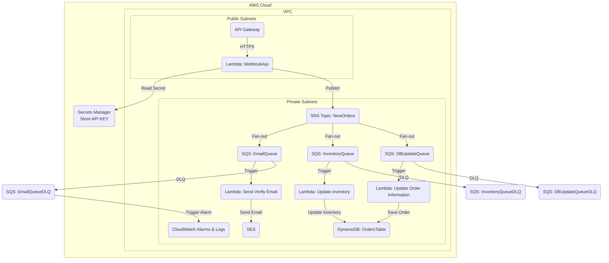

## Đề bài 2: Hệ thống Xử lý Đơn hàng Bất đồng bộ
Hệ thống xử lý webhook từ Stripe để quản lý đơn hàng một cách hiệu quả và an toàn. Khi một đơn hàng mới được tạo qua Stripe, webhook nhận dữ liệu và sẽ gửi đến API Gateway, sau đó kích hoạt một chuỗi các Lambda Functions để xử lý các tác vụ như gửi email xác nhận, cập nhật kho hàng và lưu thông tin đơn hàng vào cơ sở dữ liệu DynamoDB.

## Sơ đồ Kiến trúc



-----

## Luồng Hoạt động

1.  Stripe gửi một sự kiện đến endpoint của API Gateway.
2.  API Gateway kích hoạt Lambda Webhook Handler.
3.  **Lambda Webhook Handler:**
      * Lấy API_KEY từ AWS Secrets Manager.
      * Xác thực chữ ký của webhook để đảm bảo yêu cầu đến từ Stripe.
      * Nếu hợp lệ, publish toàn bộ payload của đơn hàng vào SNS Topic `NewOrders`.
4.  **SNS Topic** hoạt động theo mô hình "fan-out", đẩy một bản sao của tin nhắn đến tất cả các SQS Queues đã đăng ký:
      * `EmailQueue`: Hàng đợi cho tác vụ gửi email xác nhận.
      * `InventoryQueue`: Hàng đợi cho tác vụ cập nhật kho.
      * `DBUpdateQueue`: Hàng đợi để lưu thông tin chi tiết đơn hàng.
5.  Mỗi SQS Queue sẽ kích hoạt một Lambda Function tương ứng để xử lý tác vụ:
      * **Lambda Email Handler** đọc tin nhắn và sử dụng AWS SES để gửi email cho khách hàng.
      * **Lambda Inventory Handler** cập nhật số lượng sản phẩm trong DynamoDB Table.
      * **Lambda DB Update Handler** lưu thông tin đầy đủ của đơn hàng vào DynamoDB Table.
6.  Nếu bất kỳ Lambda nào xử lý lỗi và không thành công sau một số lần thử lại nhất định, tin nhắn sẽ được chuyển vào Dead-Letter Queue (DLQ) tương ứng để phân tích và xử lý thủ công.
7.  CloudWatch Alarm được cấu hình để giám sát các DLQ. Nếu có tin nhắn trong DLQ, cảnh báo sẽ được kích hoạt để thông báo cho đội vận hành.

-----

## Hướng dẫn Triển khai


### Hướng dẫn 1: Cài đặt và Triển khai cục bộ

#### Yêu cầu tiên quyết

  * Tài khoản AWS và cấu hình AWS CLI với quyền truy cập phù hợp.
  * Node.js v22+ và AWS CDK v2 (`npm install -g aws-cdk`).
  * Python 3.9+.

Clone repository này:

```bash
git clone <URL_CUA_REPOSITORY>
cd <TEN_REPOSITORY>
```

Tạo và kích hoạt môi trường ảo Python:

```bash
python3 -m venv .venv
source .venv/bin/activate
```

Cài đặt các thư viện cần thiết:

```bash
pip install -r requirements.txt
```

Bootstrap CDK (chỉ cần làm một lần cho mỗi tài khoản/region):

```bash
cdk bootstrap
```

Tạo CloudFormation Stack
```bash
cdk synth
```


Triển khai Stack:

  * CDK sẽ tự động đóng gói mã nguồn Lambda và triển khai tất cả các tài nguyên.
  * Bạn sẽ được yêu cầu xác nhận các thay đổi liên quan đến bảo mật. Nhập `y` để tiếp tục.

<!-- end list -->

```bash
cdk deploy OrderProcessingStack \        
  --parameters EmailSender={EmailSender} \
  --parameters EmailRecipient={EmailRecipient} \
  --parameters ApiKeyValue={ApiKey}
```

Lấy URL của API Gateway:

  * Sau khi triển khai thành công, CDK sẽ hiển thị một Output có tên là `ApiGatewayEndpoint`.

### Hướng dẫn 2: Cấu hình CI/CD với GitHub Actions

1.  **Tạo IAM User cho GitHub Actions:**

      * Tạo một IAM User với quyền `AdministratorAccess` (hoặc quyền tùy chỉnh phù hợp).
      * Lưu lại `Access Key ID` và `Secret Access Key` của user này.

2.  **Thêm Secrets vào GitHub Repository:**

      * Trong repository GitHub của bạn, vào **Settings \> Secrets and variables \> Actions**.
      * Tạo các secret sau:
          * `AWS_REGION`: Region AWS bạn muốn triển khai (ví dụ: `ap-southeast-1`).
          * `AWS_ACCESS_KEY_ID`: Access Key ID của IAM User.
          * `AWS_SECRET_ACCESS_KEY`: Secret Access Key của IAM User.
          * `EMAIL_SENDER`: Địa chỉ email người gửi.
          * `EMAIL_RECIPIENT`: Địa chỉ email người nhận.
          * `API_KEY`: Khóa API Key.

3.  **Commit và Push code:**

      * Sau khi push code lên nhánh `main`, GitHub Actions pipeline sẽ tự động được kích hoạt. Bạn có thể theo dõi tiến trình trong tab "Actions" của repository.

## Kiểm thử hệ thống bằng curl

Sau khi deploy thành công, lấy URL của API Gateway từ output

Test bằng lệnh curl:

```bash
curl -X POST https://api_gateway_endpoint/prod/webhook \
  -H "Content-Type: application/json" \
  -d '{"order_id": "{order_id}", "amount_total": {amount_total}, "api_key": "{api_key}"}'
```